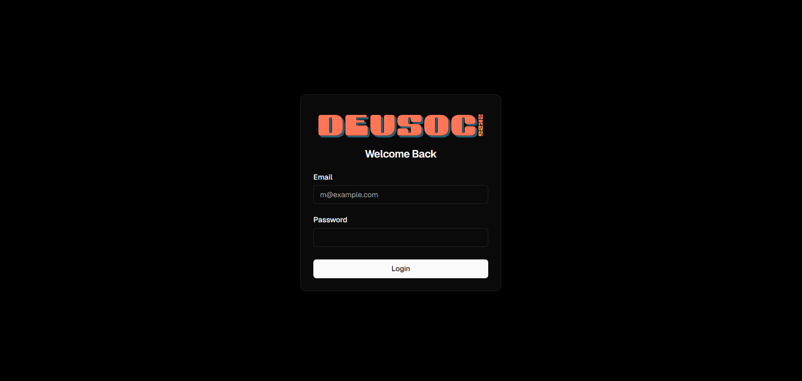
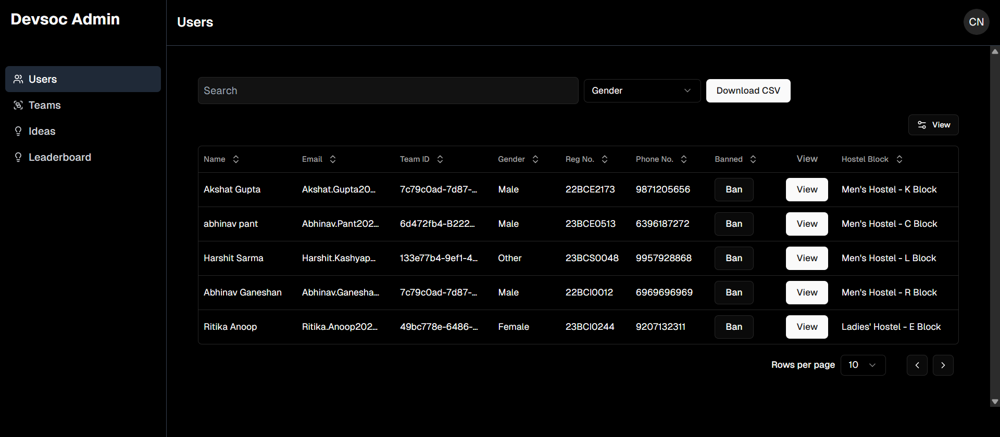

<p align="center"><a href="https://www.codechefvit.com" target="_blank"></a>
</p>

<h2 align="center"> DEVSOC'25 Admin Portal</h2>
<br/>

> <p>Welcome to the DEVSOC'25 Admin Portal, your ultimate destination for efficiently managing and maintaining your DEVSOC'25 Portal. Our intuitive and robust admin panel equips you with all the necessary tools to oversee your portal with ease. With our Admin Portal, you can effortlessly take charge and ensure seamless operation of your portal.

</p>

## ⚙️ Tech Stack:

- Next.js
- TypeScript
- Tailwind CSS
- Tanstack Query
- Tankstack Table
- React Hot Toast
- Axios
- Shadcn

## 💡 Features:

- View Users
- View Teams
- Shortlist Teams for next round
- Ban / Unban Team
- View Team Details
- Add Team Review
- Search Funtionality
- Sort According to Various Fields
- Copy important info easily

## 🖼 Screenshots

<p align="center">

#### Login Page



#### Users Page



## 🏁 Get Started

To get started, fork your own copy and clone the master branch. To clone a branch you can run the following:

```bash
git clone -b master https://github.com/<Your username>/<repo-name>
```

Run these commands on your bash/terminal and open it in a code editor of your choice.

Run the following to install all the dependencies:

```bash
pnpm i
```

To start your development server run:

```bash
pnpm dev
```

## 📝 Note:

- To have the entire functionality please note that you will have to either create your own backend or fork the official backend of DEVSOC'25:
  [https://github.com/CodeChefVIT/devsoc-be-25](https://github.com/CodeChefVIT/devsoc-be-25)
- Make sure you set user role as 'admin' in database to access all the admin specific APIs.
- You can also make a forked copy of the DEVSOC'25 Portal by heading over to: [https://github.com/CodeChefVIT/devsoc-portal-25](https://github.com/CodeChefVIT/devsoc-portal-25)
- You can also checkout DEVSOC'25 Landing here: [https://github.com/CodeChefVIT/devsoc-landing-25](https://github.com/CodeChefVIT/devsoc-landing-25)

## 🚀 Contributors

<table>
<tr align="center">
	<td>
	<p align="center">
		
	</p>
	<p style="font-size:17px; font-weight:600;">Nishant Gupta</p>
	<p align="center">
		<a href = "https://github.com/NishantGupt786"></a>
		<a href = "https://www.linkedin.com/in/nishant-gupta-12913221b/">
			
		</a>
	</p>
</td>
<td>
	<p align="center">
		
	</p>
	<p style="font-size:17px; font-weight:600;">Abhinav Ganeshan</p>
	<p align="center">
		<a href = "https://github.com/Abh1noob"></a>
		<a href = "https://www.linkedin.com/in/abhinav-gk/">
			
		</a>
	</p>
</td>
<td>
	<p align="center">
		
	</p>
	<p style="font-size:17px; font-weight:600;">Saanvi Iyer</p>
	<p align="center">
		<a href = "https://github.com/saanvi-iyer"></a>
		<a href = "https://www.linkedin.com/in/saanviiyer/">
			
		</a>
	</p>
</td>
 <td>
	<p align="center">
		
	</p>
	<p style="font-size:17px; font-weight:600;">Harshit Sarma</p>
	<p align="center">
		<a href = "https://github.com/kashyap-harshit"></a>
		<a href = "https://www.linkedin.com/in/harshit-sarma-247175179">
			
		</a>
	</p>
</td>
</tr>
<tr  align="center">
 <td>
	<p align="center">
		
	</p>
	<p style="font-size:17px; font-weight:600;">Yashita Puri</p>
	<p align="center">
		<a href = "https://github.com/yashxita"></a>
		<a href = "https://www.linkedin.com/in/yashita-puri/">
			
		</a>
	</p>
</td>
<td>
	<p align="center">
		
	</p>
	<p style="font-size:17px; font-weight:600;">Sanjay J K</p>
	<p align="center">
		<a href = "https://github.com/JKSANJAY27"></a>
		<a href = "https://www.linkedin.com/in/sanjay-j-k/">
			
		</a>
	</p>
</td>
<td>
	<p align="center">
		
	</p>
	<p style="font-size:17px; font-weight:600;">Abhinav Pant</p>
	<p align="center">
		<a href="https://github.com/abhitrueprogrammer">
			
		</a>
		<a href="https://www.linkedin.com/in/abhinav-pant/">
			
		</a>
	</p>
</td>
</tr>
</table>

## License

[](http://badges.mit-license.org)

<p align="center">
	Made with :heart: by <a href="https://www.codechefvit.com" target="_blank">CodeChef-VIT</a>
</p>
